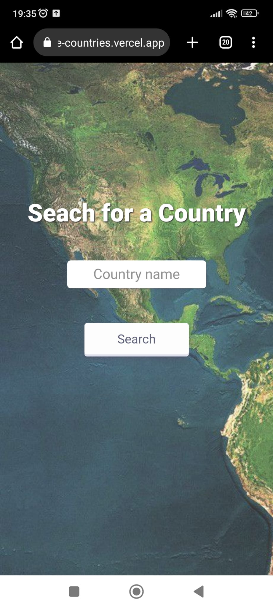

<h1 align="center">
    Countries-Information v1.0
</h1>

## About

The app "Countries-Information" is a useful tool for anyone looking to quickly and accurately obtain information about any country in the world. With just a few clicks, you can enter the desired country name and receive a wide range of information.

---

## Features

- [x] Country search: allows users to search for information about any country in the world by typing its name.
- [x] Country information: the app provide a wide range of information about the selected country, including:
   - Flag
   - Official name
   - Common name
   - Continent
   - Capital
   - Area
   - Population
- [x] Users have access to application by:
   - Desktop
   - Mobile
---

## Layout

- Desktop
<p align="center">
  
  
</p>

- Mobile
<p align="center">
  
  
</p>

## Link to application

<div align="center">
 <a href="https://bounce-countries.vercel.app/" target="_blank">Countries Information</a>
 <br>
 
</div>

---

## Getting Started

### Rodando o Back-End

```bash

# Use the git clone command followed by the URL of the repository you want to clone. 
$ git clone git@github.com:joaovprimo/project-bounce-countries-backend.git

# To install the project's dependencies, use:
$ npm install 

# After the dependencies have been installed, you can run the application in development mode using:
$ npm run dev

# You can now test and modify the project as needed.
```

### Rodando o Front-End

```bash

# Use the git clone command followed by the URL of the repository you want to clone. 
$ git clone git@github.com:joaovprimo/project-bounce-countries-front.git

# To install the project's dependencies, use: 
$ npm install 

# After the dependencies have been installed, you can start the project using:
$ npm start

# The application will open on the port: 3000 - go to http://localhost:3000
```
---
## Tech Stacks

### Front-End (React)
  - Axios
  - React Loader Spinner
  - React Router Dom
  - Styled-Components
  - Sweet Alert 2
  - Deploy: Vercel

### Server (Node.js)
  - Axios
  - CORS
  - Dotenv
  - Express
  - Https-Status
  - Joi
  - Deploy: Render
---
## External API
<a href="https://restcountries.com//" target="_blank">Rest Countries</a>

---
## GitHub Repositories
<a href="https://github.com/joaovprimo/project-bounce-countries-backend">Bounce-countries-backend</a>
<br>
<a href="https://github.com/joaovprimo/project-bounce-countries-front">Bounce-countries-frontend</a>
---
## Author

 

 <a href="tel:+353873897839" target="_blank">
 
 </a>
 <a href="mailto:jv.primo26@gmail.com" target="_blank">
 
 </a>
<a href="https://www.linkedin.com/in/joaovprimo/" target="_blank">

 </a>
 

